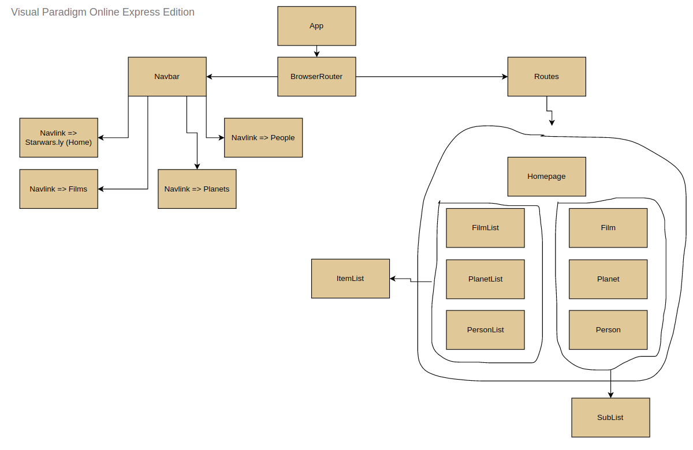

# Starwarsly

This app has the following architecture:

In addition to the above component hierarchy, the app also uses Redux action creators and combined reduxers that are implemented as helpers throughout the app components. This app also uses Redux Persist for saving the Redux store to local storage.
